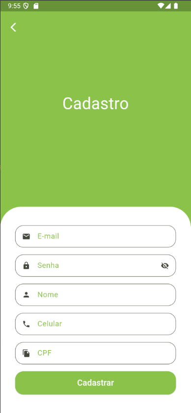
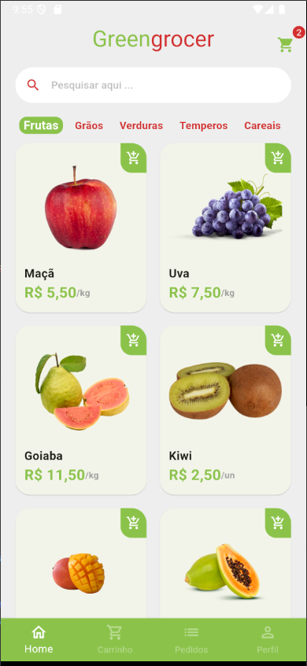
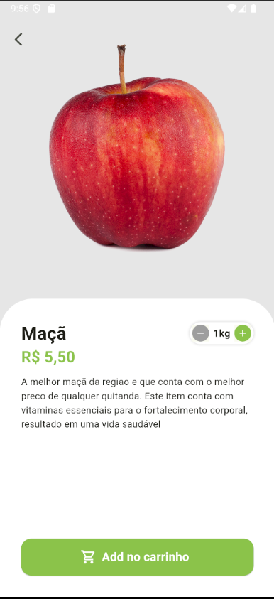
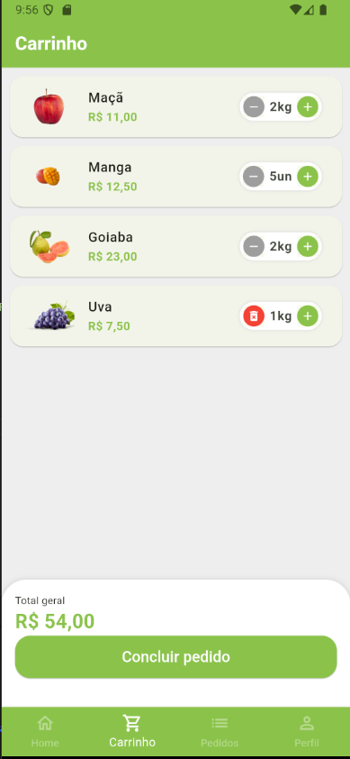
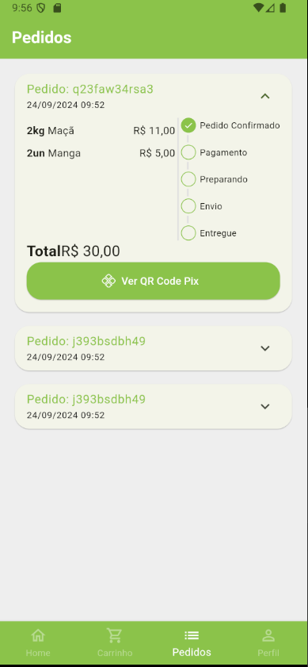
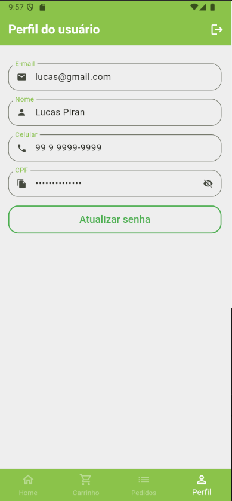

# 🛒 Flutter GreenGrocer App
Este é um aplicativo mobile desenvolvido em Flutter que simula um hortifruti virtual. Ele oferece uma experiência completa de compra, com telas para exibição de produtos, detalhes, carrinho, pedidos e informações do usuário.
## 📱 Funcionalidades
* Tela de Produtos: Exibe uma lista de produtos disponíveis.
* Detalhes do Produto: Mostra informações detalhadas de cada produto, como descrição, preço e imagem.
* Carrinho de Compras: Permite adicionar produtos ao carrinho, visualizar o total e remover itens.
* Tela de Pedidos: Exibe o histórico de pedidos feitos pelo usuário.
* Perfil do Usuário: Tela dedicada ao perfil do usuário com informações básicas.
## 🚀 Tecnologias
Este projeto foi desenvolvido com as seguintes tecnologias:

* Flutter: SDK para desenvolvimento de aplicativos multiplataforma.
* Dart: Linguagem de programação usada no Flutter.

## 📸 Capturas de Tela

## Tela de Login, Cadastro, Produto e Detalhe de produto

  
  
  
  

## Tela de Carrinho, Pedidos e Usuario

  
  
  

